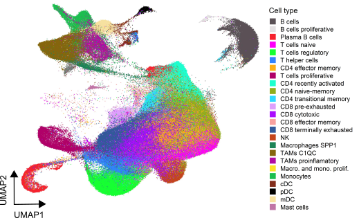

# Single-Cell Tumor Immune Atlas project
Code repository for the Single-Cell Tumor Immune Atlas project.

Find our preprint here:[https://doi.org/10.1101/2020.10.26.354829](https://doi.org/10.1101/2020.10.26.354829).

We present a single cell immune atlas of the tumor microenvironment composed by over 500k cells, 217 patients,13 cancer types, for:

 
* Patient stratification 
* Annotation 
* Spatial mapping

## Abstract

The tumor immune microenvironment is a main contributor to cancer progression and a promising therapeutic target for oncology. However, immune microenvironments vary profoundly between patients and biomarkers for prognosis and treatment response lack precision. A comprehensive compendium of tumor immune cells is required to pinpoint predictive cellular states and their spatial localization. We generated a single-cell tumor immune atlas, jointly analyzing >500,000 cells from 217 patients and 13 cancer types, providing the basis for a patient stratification based on immune cell compositions. Projecting immune cells from external tumors onto the atlas facilitated an automated cell annotation system for a harmonized interpretation. To enable in situ mapping of immune populations for digital pathology, we developed, benchmarked and applied SPOTlight, a computational tool that identified striking spatial immune cell patterns in tumor sections. We expect the atlas, together with our versatile toolbox for precision oncology, to advance currently applied stratification approaches for prognosis and immuno-therapy.

## Code implementation

Folders and content:

* `Integration`: scripts necessary to create the atlas
* `Patient stratification`: clustering of the patients and assessment by random forest
* `Projections`: projecting external data onto the atlas
* `Random Forest`: assessment of the clustering robustness
* `ST-breast`: analysis of the spatial transcriptomics breast data
* `ST-oropharyngeal`: analysis of the spatial transcriptomics oropharyngeal data

See the `README.md` files in each directory for a full description.

## Getting the data
The Single-Cell Tumor Immune Atlas dataset is open access on [Zenodo](https://zenodo.org/record/4139398#.X5_tRYhKiHs).

## Getting the code

You can download a copy of all the files in this repository by cloning the
[git](https://git-scm.com/) repository:

    git clone https://github.com/Single-Cell-Genomics-Group-CNAG-CRG/Tumor-Immune-Cell-Atlas.git

or [download a zip archive](https://github.com/Single-Cell-Genomics-Group-CNAG-CRG/Tumor-Immune-Cell-Atlas/archive/main.zip).

## Dependencies

The dependencies for each part of the analysis are listed in each of the folders.
